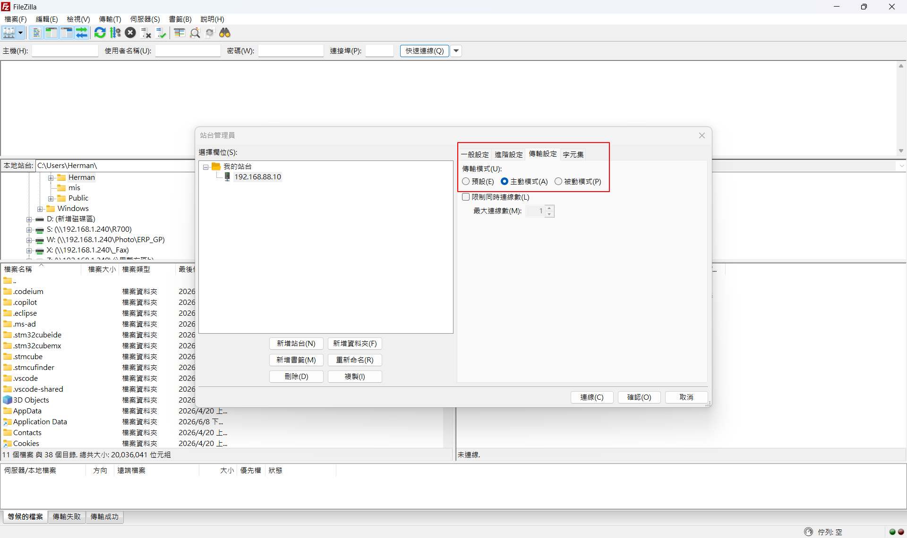
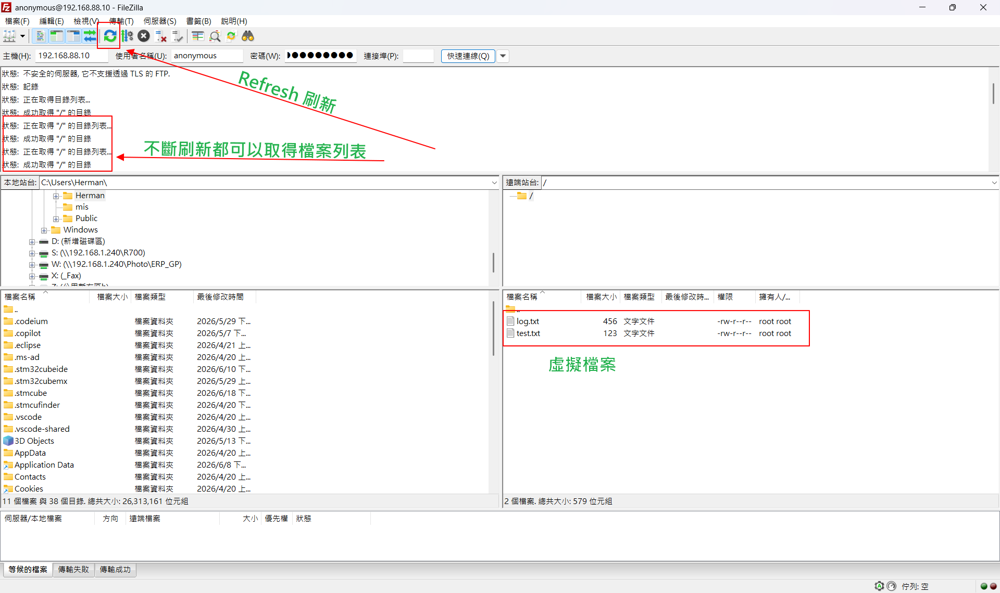

# STM32H755 FTP Server Using LwIP Raw API
### Building an FTP Server on STM32H755: From ARP and Ping to FileZilla Integration

## From Ethernet ARP, Ping, TCP Server to FTP Server using LwIP Raw API


---
## 檔案修改更新紀錄在最底層紀錄
---

# Overview

This project demonstrates how to build an FTP Server on the STM32H755ZI-Q development board using the STM32CubeH7 Ethernet driver and the LwIP Raw API stack.

The purpose of this project is not only to implement an FTP Server, but also to understand how Ethernet communication is established layer by layer from the physical network interface up to the application layer.

The development process starts from basic Ethernet connectivity verification and gradually progresses through:

1. Ethernet PHY initialization
2. ARP communication
3. ICMP Ping response
4. TCP Server implementation
5. FTP Control Channel
6. FTP Passive Data Channel
7. FileZilla Client interoperability

This repository serves as a learning reference for embedded Ethernet protocol development on STM32 devices.

---

# Hardware Platform

## Development Board

STM32H755ZI-Q Nucleo

### Features

* Dual-Core Cortex-M7 / Cortex-M4
* Integrated Ethernet MAC
* RMII Interface
* LwIP Network Stack Support
* STM32CubeMX Auto Configuration

---

# Software Environment

| Component        | Version           |
| ---------------- | ----------------- |
| STM32CubeIDE     | Latest            |
| STM32CubeMX      | Latest            |
| STM32CubeH7      | Latest            |
| LwIP             | CubeMX Integrated |
| FileZilla Client | Latest            |
| Windows          | Windows 11        |

---

# Project Objectives

The primary objective is to understand how application-layer protocols are built on top of Ethernet networking.

The final target is:

```text
FileZilla Client
        │
        ▼
STM32 FTP Server
        │
        ▼
LwIP TCP/IP Stack
        │
        ▼
Ethernet Driver
        │
        ▼
RMII PHY
```

---

# Relationship to the OSI Model

The project gradually covers multiple layers of the OSI network model.

| OSI Layer            | Protocol / Function |
| -------------------- | ------------------- |
| Layer 7 Application  | FTP                 |
| Layer 6 Presentation | FTP Text Commands   |
| Layer 5 Session      | FTP Control Session |
| Layer 4 Transport    | TCP                 |
| Layer 3 Network      | IP / ICMP           |
| Layer 2 Data Link    | Ethernet / ARP      |
| Layer 1 Physical     | RMII PHY            |

---

# Development Journey

---

## Stage 1 - Ethernet Initialization

Successfully configured:

* Ethernet MAC
* RMII Interface
* LAN8742 PHY
* LwIP Stack

Verified that the STM32 network interface could obtain and use a static IP address.

Example:

```text
IP Address:
192.168.88.10
```

---

## Stage 2 - ARP Verification

ARP (Address Resolution Protocol) is required before any IP communication can occur.

Verified:

```text
PC
 ↓
ARP Request
 ↓
STM32
 ↓
ARP Reply
```

Successful ARP communication confirmed that:

* Ethernet MAC was functioning
* PHY communication was working
* LwIP link layer was operational

---

## Stage 3 - Ping Test (ICMP)

After ARP was verified, ICMP Echo Reply testing was performed.

Command:

```bash
ping 192.168.88.10
```

Successful ping response confirmed:

* IP Layer operation
* ICMP processing
* Network Layer functionality

---

## Stage 4 - TCP Server

Implemented a TCP Server using the LwIP Raw API.

Listening Port:

```text
TCP Port 21
```

Verification:

```powershell
telnet 192.168.88.10 21
```

Result:

```text
220 STM32 FTP Server Ready
```

This confirmed:

* TCP Three-Way Handshake
* TCP Connection Establishment
* Application Layer Communication

---

## Stage 5 - FTP Control Channel

Implemented FTP command parsing.

Supported Commands:

```text
USER
PASS
SYST
FEAT
PWD
XPWD
TYPE
NOOP
QUIT
PASV
PORT
CWD
LIST
NLST
RETR
```

Example Session:

```text
USER anonymous
PASS anonymous

PWD

257 "/" is current directory
```

---

## Stage 6 - FTP Passive Mode (PASV)

FTP requires a second TCP connection for data transfer.

Control Channel:

```text
Port 21
```

Data Channel:

```text
Port 2020
```

Example:

```text
Client
    PASV
Server
    227 Entering Passive Mode
Client
    Connect Port 2020
```

---

## Stage 7 - Directory Listing

Implemented:

```text
LIST
NLST
```

Virtual files:

```text
test.txt
log.txt
```

Successfully displayed within FileZilla.

---

## Stage 8 - File Download

Implemented:

```text
RETR
```

Virtual file download over FTP Data Channel.

Example:

```text
RETR log.txt
```

Result:

```text
File transferred successfully
```

---

# FileZilla Interoperability

The FTP Server was validated using FileZilla Client.

Connection Settings:

```text
Protocol:
FTP

Encryption:
Use Plain FTP

Host:
192.168.88.10

Port:
21

Username:
anonymous

Password:
anonymous
```

Connection Sequence:

```text
Connect
 ↓
USER
 ↓
PASS
 ↓
PWD
 ↓
TYPE I
 ↓
PASV
 ↓
LIST
 ↓
RETR
```

Directory listing and file download were both successfully verified.

---

# FTP Architecture

```text
                 FileZilla Client
                         │
                         │
              FTP Control Channel
                   TCP Port 21
                         │
                         ▼
                STM32 FTP Server
                         │
         ┌───────────────┴───────────────┐
         │                               │
         ▼                               ▼
 Control Command Parsing        FTP Data Channel
                                     TCP 2020
                                          │
                                          ▼
                           Virtual Directory / Files
```

---

# Current Status

## Implemented

* Ethernet Driver
* RMII PHY Communication
* ARP
* ICMP Ping
* TCP Server
* FTP Login
* FTP Passive Mode
* Directory Listing
* File Download
* FileZilla Compatibility

---

## Not Yet Implemented

* FatFs
* SDMMC
* Real File System
* STOR Upload
* DELE Delete
* RNFR / RNTO Rename
* MKD Directory Create
* RMD Directory Delete

---

# Future Roadmap

## Version 0.2

Add:

```text
FatFs
SDMMC
Real File Access
```

Directory listing will be generated dynamically from the SD Card root directory.

---

## Version 0.3

Add:

```text
STOR Upload
DELE
RNFR
RNTO
```

Allow complete file management from FileZilla.

---

## Version 1.0

Complete Embedded FTP Server:

```text
FTP Server
+
LwIP Raw API
+
FatFs
+
SDMMC
+
DMA Optimization
```

---

# Conclusion

This project demonstrates the complete path from low-level Ethernet communication to a working FTP Server on STM32H755.

Through the development process, the following technologies were explored and verified:

* Ethernet MAC
* RMII PHY
* ARP
* ICMP
* TCP
* FTP
* LwIP Raw API
* FileZilla Interoperability

The project provides a practical example of how the OSI model is implemented on an embedded system and serves as a foundation for future SD Card based FTP file servers.

## 修改檔案：
* CM7\Core\Src\main.c
* CM4\Core\Src\main.c
* CM4\Core\Src\tcp_server.c
* CM4\Core\Inc\tcp_server.h

---
# 檔案修改紀錄

### [2026-06-18]
1. 使用 Filezilla client 連接 CM4 FTP Server 式採用預設 被動模式 (PASV) 連接，上一版本程式 CM4\Core\Src\tcp_server.c 雖然可以做到首次連線可以成功並看到 虛擬檔案列表， 但執行 F5 Refresh 就會斷線。
2. 更新版本已經修復此問題，首次連上線後，顯示虛擬檔案列表，重複多次 Refresh 都可以正常顯示 虛擬檔案列表，不會中斷連線。
3. 為什麼這次能成功解決 Refresh 問題？
資料不會被腰斬：呼叫 send_dir_list 時，程式只負責把資料寫入發送佇列。接著程式就退出了。

非同步安全關閉：當 STM32 的網卡真正把資料送出，且 FileZilla 回覆「我收到了（ACK）」之後，lwIP 內部會觸發我們設定的 ftp_data_sent_callback。這時候再調用 tcp_close(tpcb)，通道關閉得優雅完整，資料百分之百看得見。

沒有重新綁定 Port 失敗的問題：因為 pasv_pcb（Port 2020 監聽器）從頭到尾常駐在背景，不拆除、不重新 bind，所以不論 FileZilla 點擊 Refresh 的速度有多快，Port 2020 永遠都開著門準備迎接下次的連線，絕對不會產生 ECONNREFUSED 或 ECONNABORTED 的錯誤。

---

## 圖示





